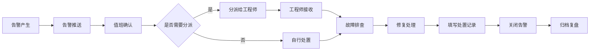
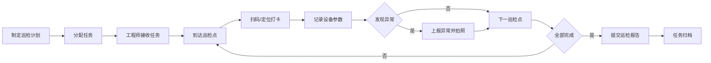
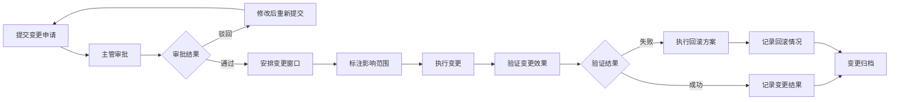

# 数据中心基础设施运维管理平台 - 产品需求文档

## 1. 产品概述

数据中心基础设施运维管理平台是面向机房运维团队的一体化管理系统，用于统一管理机柜、UPS、空调、配电和消防设备，实现设备全生命周期管理、告警智能处置、巡检规范化、容量精细化规划和变更流程化管理。

- **核心目标**：提升数据中心运维效率，降低故障率，保障业务连续性
- **目标用户**：机房运维工程师、运维主管、数据中心经理
- **核心价值**：可视化管理、智能化告警、流程化作业、数据化决策

## 2. 核心功能

### 2.1 用户角色

| 角色 | 注册方式 | 核心权限 |
|------|----------|----------|
| 运维工程师 | 系统创建 | 设备查看、告警处置、巡检执行、备件领用 |
| 运维主管 | 系统创建 | 全部查看权限、告警分派、变更审批、任务分配 |
| 数据中心经理 | 系统创建 | 全局视图、报表查看、容量规划、SLA监控 |

### 2.2 功能模块

1. **机房总览**：全局状态仪表盘、设备健康度、关键指标实时展示
2. **机柜视图**：机柜可视化布局、U位占用、设备定位、实时负载
3. **设备台账**：设备全生命周期管理、资产信息、维保记录、备件管理
4. **告警处置**：实时告警监控、告警分派、值班确认、故障复盘
5. **巡检任务**：巡检计划制定、巡检打卡、异常上报、任务跟踪
6. **容量规划**：空间容量、电力容量、制冷容量统计与预测
7. **变更记录**：变更申请、审批流程、影响范围标注、历史追溯
8. **报表中心**：SLA统计、负载分析、设备可用性、运维绩效报表

### 2.3 页面详情

| 页面名称 | 模块名称 | 功能描述 |
|----------|----------|----------|
| 机房总览 | 全局仪表盘 | 设备总数、在线率、告警数量、PUE值、温湿度趋势图 |
| 机房总览 | 快速入口 | 八大功能模块快捷导航、关键告警提醒 |
| 机柜视图 | 机房布局 | 3D/2D机房平面图、机柜位置标注、状态颜色标识 |
| 机柜视图 | 机柜详情 | U位可视化、设备列表、电力负载、温度分布 |
| 设备台账 | 设备列表 | 多维度筛选、设备状态、资产编号、维保信息 |
| 设备台账 | 设备详情 | 基本信息、运行参数、历史记录、关联备件、资产标签打印 |
| 告警处置 | 告警列表 | 实时告警、级别筛选（紧急/重要/一般/提示）、处置状态 |
| 告警处置 | 告警详情 | 告警信息、处置流程、分派记录、故障复盘记录 |
| 巡检任务 | 任务看板 | 今日任务、待执行、已完成、逾期任务统计 |
| 巡检任务 | 巡检执行 | 巡检点打卡、拍照上传、异常记录、电子签名 |
| 容量规划 | 容量统计 | 空间占用率、电力负载率、制冷负载率、趋势分析 |
| 容量规划 | 容量预测 | 基于历史数据的容量预测、扩容建议 |
| 变更记录 | 变更列表 | 变更类型、状态、申请人、审批人、时间线 |
| 变更记录 | 变更详情 | 变更内容、影响范围标注、审批流程、回滚方案 |
| 报表中心 | 统计报表 | SLA达成率、设备可用性、告警统计、巡检完成率 |
| 报表中心 | 自定义报表 | 多维度数据筛选、图表展示、导出Excel/PDF |

## 3. 核心流程

### 3.1 告警处置流程

运维人员登录系统后，在机房总览查看实时告警，进入告警处置页面选择待处理告警，进行告警确认或分派给指定工程师，工程师接收告警后进行故障排查和修复，完成后填写处置记录并关闭告警，系统自动记录整个处置过程用于后续复盘。

### 3.2 巡检执行流程

管理员制定巡检计划并分配任务，运维工程师在巡检任务页面查看待执行任务，按照巡检路线逐个打卡，记录设备状态和参数，发现异常立即上报，完成全部巡检点后提交任务，系统自动生成巡检报告。

### 3.3 变更管理流程

申请人提交变更申请，详细说明变更内容、影响范围和回滚方案，主管进行审批，审批通过后安排变更窗口，执行变更前进行影响范围标注，变更完成后验证效果，记录变更结果并归档。

## 4. 用户界面设计

### 4.1 设计风格

**设计主题：工业科技风（Industrial Tech）**
- **主色调**：深海蓝 `#0F172A` 作为主背景，营造专业稳重的工业氛围
- **辅助色**：科技青 `#06B6D4` 用于强调和交互元素，体现科技感
- **状态色**：
  - 正常：翡翠绿 `#10B981`
  - 警告：琥珀黄 `#F59E0B`
  - 严重：橙红 `#F97316`
  - 紧急：危险红 `#EF4444`
  - 离线：中性灰 `#6B7280`
- **字体**：
  - 标题：`Space Grotesk` - 具有几何感的现代无衬线字体，体现工业精密感
  - 正文：`Inter` - 清晰易读的界面字体，确保数据可读性
- **按钮风格**：直角或微圆角（2px），实心按钮带有微妙的渐变和阴影，体现工业质感
- **布局风格**：模块化卡片布局，卡片带有细微边框和投影，层次分明
- **图标风格**：线性图标，线条粗细统一（1.5px），配合状态色使用
- **视觉细节**：
  - 深色主题下的发光效果（Glow）用于强调关键数据
  - 网格纹理背景，增强工业科技感
  - 数据仪表盘采用拟物化设计，带有刻度和指针动画

### 4.2 页面设计概览

| 页面名称 | 模块名称 | UI元素 |
|----------|----------|--------|
| 机房总览 | 全局仪表盘 | 大数字指标卡、环形进度图、趋势折线图、告警跑马灯 |
| 机房总览 | 快速入口 | 图标卡片网格、悬停放大效果、状态角标 |
| 机柜视图 | 机房布局 | 2D热力图、机柜色块、悬停提示框、缩放控制 |
| 机柜视图 | 机柜详情 | U位垂直列表、设备图标堆叠、负载进度条、温度色阶 |
| 设备台账 | 设备列表 | 数据表格、行悬停高亮、状态标签、筛选侧边栏 |
| 设备台账 | 设备详情 | 标签页导航、信息卡片组、时间线记录、操作按钮组 |
| 告警处置 | 告警列表 | 按级别分栏、告警卡片堆叠、闪烁动画、快捷操作按钮 |
| 告警处置 | 告警详情 | 时间线处置记录、人员头像、分派下拉框、复盘文本域 |
| 巡检任务 | 任务看板 | 列视图看板、任务卡片拖拽、进度条、逾期红色标识 |
| 巡检任务 | 巡检执行 | 步骤指示器、打卡按钮、拍照上传、异常标记复选框 |
| 容量规划 | 容量统计 | 三维柱状图、环形图、容量水位线、预测趋势虚线 |
| 容量规划 | 容量预测 | 折线图对比、风险区域标注、建议卡片、数据表格 |
| 变更记录 | 变更列表 | 时间线布局、状态徽章、影响范围预览图、审批进度条 |
| 变更记录 | 变更详情 | 分步骤表单、影响范围标注画布、审批意见框、附件上传 |
| 报表中心 | 统计报表 | 多种图表切换、数据钻取、过滤器面板、导出按钮 |
| 报表中心 | 自定义报表 | 维度选择器、图表配置面板、实时预览、保存模板 |

### 4.3 响应式设计

- **桌面优先**：针对 1920×1080 及以上分辨率优化，适配运维监控大屏
- **平板适配**：1024px 断点，侧边栏可收起，表格支持横向滚动
- **触控优化**：按钮最小尺寸 44×44px，确保平板操作便捷
- **大屏展示**：支持全屏模式，隐藏非必要UI元素，突出数据展示

### 4.4 交互动效

- **页面加载**：仪表盘数据从0到目标值的数字滚动动画，图表渐进式绘制
- **状态变化**：设备状态变更时带有颜色过渡动画和轻微缩放
- **告警推送**：新告警从右侧滑入，紧急告警带有脉冲闪烁效果
- **卡片悬停**：轻微上浮（translateY(-2px)）+ 阴影加深
- **导航切换**：侧边栏展开/收起带有平滑过渡，内容区域自适应
- **数据刷新**：实时数据更新时带有淡入效果，避免视觉跳变
