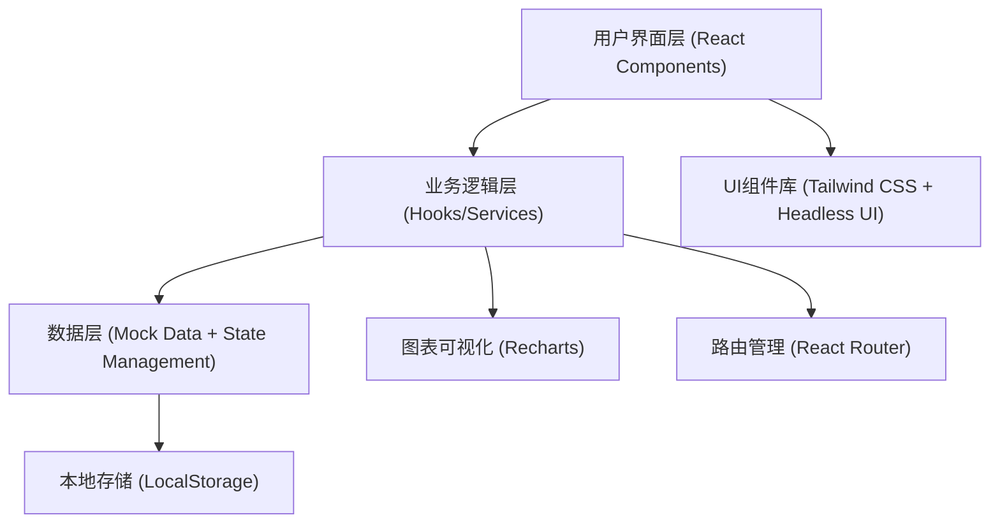
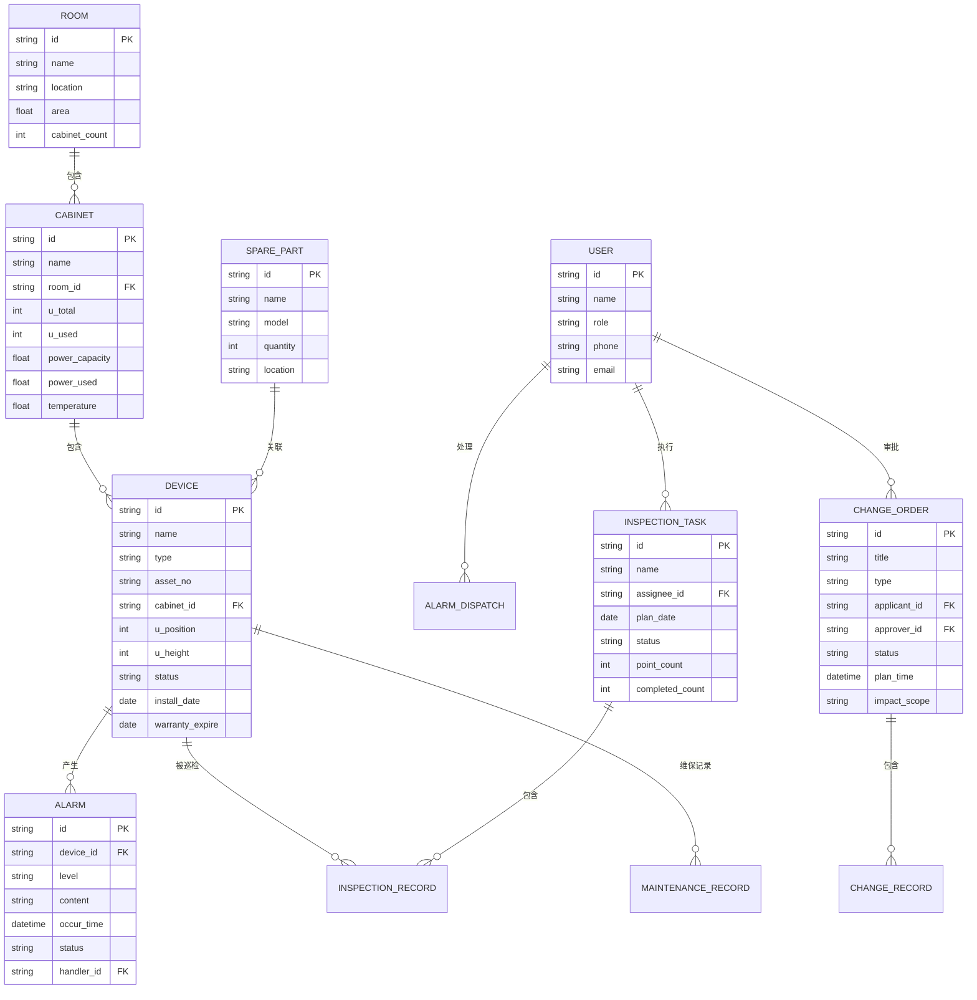

# 数据中心基础设施运维管理平台 - 技术架构文档

## 1. 架构设计

本项目采用纯前端单页应用架构，使用 Mock 数据模拟后端服务，便于快速开发和演示。整体架构分为表现层、业务逻辑层和数据层。



## 2. 技术选型说明

- **前端框架**：React@18 + TypeScript
  - 选择理由：组件化开发、类型安全、生态丰富，适合构建复杂的管理系统
- **构建工具**：Vite@5
  - 选择理由：开发启动快、热更新效率高、构建优化出色
- **样式方案**：Tailwind CSS@3
  - 选择理由：原子化CSS、开发效率高、易于统一设计规范
- **UI组件**：Headless UI + Heroicons
  - 选择理由：无样式组件、高度可定制、与Tailwind完美集成
- **图表库**：Recharts@2
  - 选择理由：React原生、配置灵活、支持多种图表类型
- **路由管理**：React Router@6
  - 选择理由：React官方推荐、功能完善、嵌套路由支持好
- **状态管理**：React Context + useReducer
  - 选择理由：轻量级、无需额外依赖、满足中后台系统需求
- **日期处理**：date-fns
  - 选择理由：函数式、按需加载、体积小
- **Mock数据**：MSW (Mock Service Worker)
  - 选择理由：拦截真实请求、开发体验接近真实后端

## 3. 路由定义

| 路由路径 | 页面名称 | 功能说明 |
|----------|----------|----------|
| `/` | 机房总览 | 全局仪表盘、关键指标、快速入口 |
| `/cabinet` | 机柜视图 | 机房布局、机柜详情、U位管理 |
| `/devices` | 设备台账 | 设备列表、设备详情、资产管理 |
| `/alarms` | 告警处置 | 告警列表、告警详情、处置流程 |
| `/inspection` | 巡检任务 | 任务看板、巡检执行、异常上报 |
| `/capacity` | 容量规划 | 容量统计、容量预测、扩容建议 |
| `/changes` | 变更记录 | 变更列表、变更详情、审批流程 |
| `/reports` | 报表中心 | 统计报表、自定义报表、数据导出 |

## 4. 目录结构

```
src/
├── assets/              # 静态资源
│   ├── images/          # 图片资源
│   └── styles/          # 全局样式
├── components/          # 公共组件
│   ├── layout/          # 布局组件
│   ├── ui/              # 基础UI组件
│   └── charts/          # 图表组件
├── pages/               # 页面组件
│   ├── Dashboard/       # 机房总览
│   ├── Cabinet/         # 机柜视图
│   ├── Devices/         # 设备台账
│   ├── Alarms/          # 告警处置
│   ├── Inspection/      # 巡检任务
│   ├── Capacity/        # 容量规划
│   ├── Changes/         # 变更记录
│   └── Reports/         # 报表中心
├── hooks/               # 自定义Hooks
├── services/            # API服务
├── store/               # 状态管理
├── types/               # TypeScript类型定义
├── utils/               # 工具函数
├── mock/                # Mock数据
├── App.tsx              # 根组件
├── main.tsx             # 入口文件
└── router.tsx           # 路由配置
```

## 5. 数据模型

### 5.1 实体关系图



### 5.2 核心数据类型定义

```typescript
// 设备类型
type DeviceType = 'server' | 'switch' | 'ups' | 'aircon' | 'power' | 'fire';
type DeviceStatus = 'online' | 'offline' | 'warning' | 'fault' | 'maintenance';

interface Device {
  id: string;
  name: string;
  type: DeviceType;
  assetNo: string;
  cabinetId: string;
  uPosition: number;
  uHeight: number;
  status: DeviceStatus;
  installDate: string;
  warrantyExpire: string;
  manufacturer: string;
  model: string;
  sn: string;
  power: number;
  params: Record<string, any>;
}

// 告警类型
type AlarmLevel = 'critical' | 'major' | 'minor' | 'info';
type AlarmStatus = 'pending' | 'confirmed' | 'dispatched' | 'processing' | 'resolved' | 'closed';

interface Alarm {
  id: string;
  deviceId: string;
  deviceName: string;
  level: AlarmLevel;
  content: string;
  occurTime: string;
  status: AlarmStatus;
  handlerId?: string;
  handlerName?: string;
  dispatchTime?: string;
  resolveTime?: string;
  resolveNote?: string;
}

// 机柜
interface Cabinet {
  id: string;
  name: string;
  roomId: string;
  row: number;
  column: number;
  uTotal: number;
  uUsed: number;
  powerCapacity: number;
  powerUsed: number;
  temperature: number;
  humidity: number;
  devices: Device[];
}

// 巡检任务
type InspectionStatus = 'pending' | 'in_progress' | 'completed' | 'overdue';

interface InspectionTask {
  id: string;
  name: string;
  assigneeId: string;
  assigneeName: string;
  planDate: string;
  status: InspectionStatus;
  pointCount: number;
  completedCount: number;
  points: InspectionPoint[];
}

interface InspectionPoint {
  id: string;
  name: string;
  deviceId: string;
  deviceName: string;
  location: string;
  checked: boolean;
  checkTime?: string;
  remark?: string;
  abnormal: boolean;
  photos: string[];
}

// 变更记录
type ChangeStatus = 'draft' | 'pending_approval' | 'approved' | 'rejected' | 'implementing' | 'completed' | 'rolled_back';
type ChangeType = 'hardware' | 'software' | 'network' | 'power' | 'aircon' | 'other';

interface ChangeOrder {
  id: string;
  title: string;
  type: ChangeType;
  applicantId: string;
  applicantName: string;
  approverId?: string;
  approverName?: string;
  status: ChangeStatus;
  planTime: string;
  actualTime?: string;
  impactScope: string;
  description: string;
  rollbackPlan: string;
  approvalOpinion?: string;
  createdAt: string;
}

// 容量数据
interface CapacityData {
  space: {
    total: number;
    used: number;
    rate: number;
  };
  power: {
    total: number;
    used: number;
    rate: number;
  };
  cooling: {
    total: number;
    used: number;
    rate: number;
  };
}

// 报表数据
interface ReportData {
  sla: {
    uptime: number;
    target: number;
    actual: number;
  };
  alarms: {
    total: number;
    resolved: number;
    resolutionRate: number;
    avgResolutionTime: number;
  };
  inspection: {
    total: number;
    completed: number;
    completionRate: number;
    abnormalCount: number;
  };
}
```

## 6. 状态管理设计

采用 React Context + useReducer 进行状态管理，按模块划分 Context：

- `AppContext`：全局应用状态（用户信息、主题、侧边栏状态）
- `DeviceContext`：设备相关状态
- `AlarmContext`：告警相关状态
- `InspectionContext`：巡检相关状态

## 7. 性能优化策略

1. **代码分割**：基于路由的懒加载，减少首屏加载体积
2. **组件优化**：使用 React.memo、useMemo、useCallback 避免不必要重渲染
3. **虚拟列表**：设备台账等长列表采用虚拟滚动
4. **图表优化**：大数据量图表采用采样和渐进加载
5. **状态持久化**：关键状态存入 localStorage，刷新不丢失
6. **防抖节流**：搜索、筛选等操作添加防抖处理

## 8. 安全考虑

1. **路由守卫**：根据用户角色控制页面访问权限
2. **XSS防护**：使用 React 自带的 XSS 防护，危险区域使用 DOMPurify
3. **数据脱敏**：敏感信息（如手机号、邮箱）展示时脱敏处理
4. **操作日志**：关键操作记录操作人和操作时间
